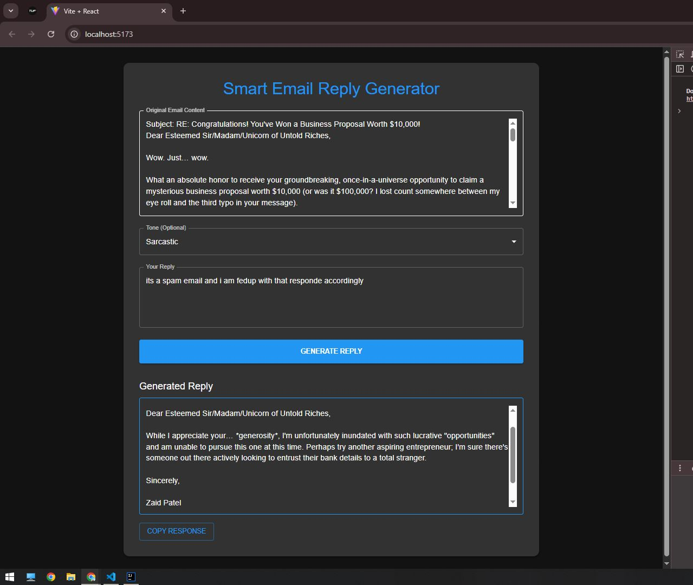

# Smart Email Reply Assistant

An AI-powered email assistant that generates contextual, professional replies using Google's Gemini API. Designed to improve communication efficiency, this tool automates email responses with options to customize tone and style directly within a web app or Gmail extension.

---

## Features

- Automatically generates email replies based on the content of received messages
- Integrated Gmail extension adds a "Generate with AI" button next to the native Send button
- Tone and style customization available (e.g., formal, friendly, urgent)
- Built-in editor to review and modify AI-generated replies before sending
- Supports copy-paste email input via the web interface for flexibility

---

## Tech Stack

| Layer        | Technologies                         |
|--------------|------------------------------------|
| Frontend     | React.js, HTML, CSS                 |
| Backend      | Java, Spring Boot                   |
| AI API       | Gemini API (Google AI)              |
| Extension    | JavaScript (Gmail DOM manipulation)|
| Tools        | Git, GitHub, REST APIs, VS Code    |

---

## Architecture Overview

1. **Frontend**
    - Provides a user-friendly UI with input fields and a tone selection dropdown
    - Displays AI-generated replies with an option to edit before copying or sending
    - **Static assets including images are located in:**  
      `src/main/resources/static`  
      Example image: `AI-Email-Assistant.png`

2. **Backend**
    - Accepts email content and tone/style preference via REST API
    - Processes the request and communicates with the Gemini API
    - Returns a generated response based on the given context and tone

3. **Browser Extension**
    - Integrates into Gmail UI
    - Captures email content and passes it to the backend
    - Inserts AI-generated reply directly into the email editor

---

## How to Use

### Web App

1. Paste a received email into the input field
2. Select the desired tone or style (e.g., formal, friendly, urgent)
3. Click "Generate"
4. Review and copy the response into your actual email client

### Gmail Extension

1. Install the Chrome extension
2. Open Gmail and start composing a reply
3. Click the "Generate with AI" button
4. AI-generated reply will appear in the message box
5. Make edits if needed and send

---